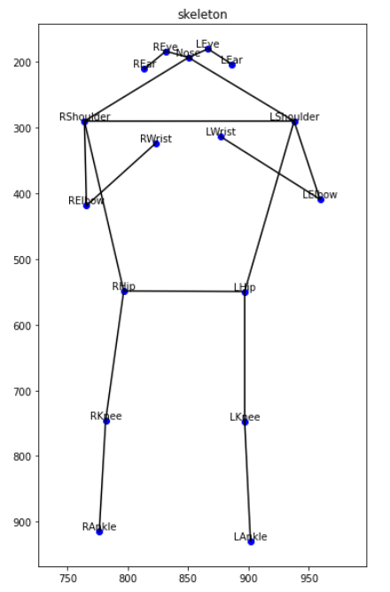
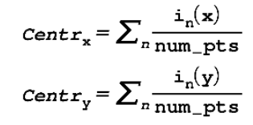
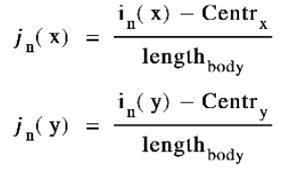

# 2D Keypoints Pose Classifier
Body normalization and classifier using MoveNet

 

Skeleton via tensorflow.js library
MoveNet with 17 2D Keypoints
Find the center of gravity of the head, upper body, and lower body
Learning using machine learning after normalizing the skeleton

### 17 keypoints center of gravity

### Normalize each x,y by adding the head, upper body, and lower body

### 1./ Data extract
https://blog.tensorflow.org/2021/08/3d-pose-detection-with-mediapipe-blazepose-ghum-tfjs.html - MoveNet 사용

### 2./ Model
sklearn -
Randomforest, LogisticRegression, SVC, LGBM, Voting

### 3./ Reference Paper
https://www.matec-conferences.org/articles/matecconf/pdf/2017/46/matecconf_dts2017_05016.pdf
