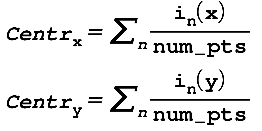
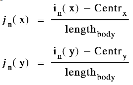

# 2D Keypoints Pose Classifier

 

tensorflow.js 라이브러리를 통한 스켈레톤 
MoveNet 17개 2D Keypoint 사용
머리, 상체, 하체의 무게중심을 구하여 
스켈레톤을 정규화 시킨 후 머신러닝을 이용한 학습

### 17 keypoints으로 중심값 구하기

### 머리, 상체, 하체를 더해 각 x,y 정규화

### 1./ Data extract
https://blog.tensorflow.org/2021/08/3d-pose-detection-with-mediapipe-blazepose-ghum-tfjs.html - MoveNet 사용

### 2./ Model
사용 라이브러리 - sklearn 
Randomforest, LogisticRegression, SVC, LGBM, Voting

### 3./ Reference Paper
https://www.matec-conferences.org/articles/matecconf/pdf/2017/46/matecconf_dts2017_05016.pdf
